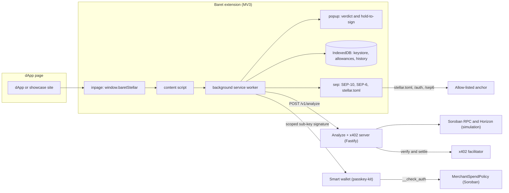
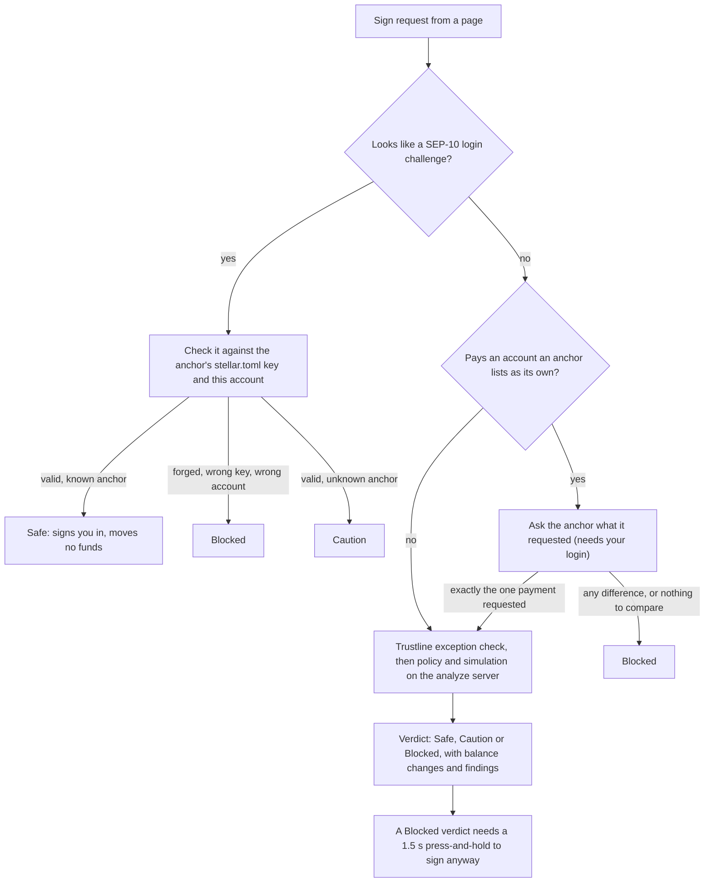
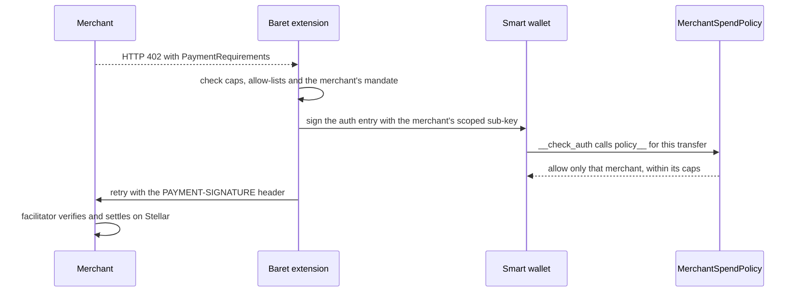

# Baret

[](https://github.com/Aeztrest/Baret-Stellar/actions/workflows/ci.yml)

> **The Stellar smart wallet with a transaction firewall.**
> Pre-sign simulation, per-site policy, rolling spend caps, and the first
> wallet-level defense for the **x402** agentic-payment protocol — backed by an
> on-chain **MerchantSpendPolicy** Soroban contract that gates spending
> directly on the user's own smart wallet. Non-custodial: funds never leave
> the wallet — the contract only decides which scoped signer may authorize
> what, up to what cap.

Baret ships as a Chrome/Firefox extension, a live showcase that proves every
claim with **real Stellar testnet transactions**, a merchant + analysis server,
and a deployed Soroban smart contract. It is a single pnpm monorepo.

## At a glance

**Testnet only, unaudited.** The hosted analyze + x402 server is
<https://baret-stellar.onrender.com> (`/health`, `/openapi.json`; the free plan
sleeps when idle, so the first request can take about 30 seconds).

| Area | State | How it was checked |
|---|---|---|
| Pre-sign analysis (26 finding codes, policy presets) | Built and live | Server test suite (181 tests), live on the hosted server |
| x402 firewall in the wallet (caps, mandates, allow-lists) | Built and used | Real testnet settlement through the `/scrybe` and `/cortex` demos; extension test suite (288 tests) |
| **MerchantSpendPolicy** on-chain sub-key caps | Built and deployed | 14 contract unit tests; the live testnet end-to-end checklist was run by the team and passed on 2026-09-20 (wallet address and transaction hashes were not recorded) |
| **Anchor sign-in (SEP-10)** and blocking of forged login challenges | Built | Attack fixtures in tests; a real login against the live mock anchor from the built extension in Chromium |
| SEP-6 `/info`, anchor-asset trustline exception, account setup panel | Built | Same live run: `/info`, Friendbot funding and the USDC trustline worked from the extension |
| SEP-6 withdrawal guard | Built | **Tested against a simulated anchor only**, never against a real withdrawal (see [Anchors](#stellar-anchors-sep-1-sep-6-sep-10)) |
| Deposit and withdraw flows, SEP-12, SEP-38, `G` to smart-wallet bridge | **Not built** | See [Anchors](#stellar-anchors-sep-1-sep-6-sep-10) for why |
| Verdict attestation | Code exists, **off** on the hosted server | Not verified by the extension yet |

Known limits are listed openly in [`LIMITATIONS.md`](./LIMITATIONS.md); the
spec-versus-code ledger is
[`docs/implementation-status.md`](./docs/implementation-status.md).

---

## 🛰️ Deployed Soroban contract (Stellar testnet)

The on-chain heart of Baret. **MerchantSpendPolicy** is a non-custodial
spending policy, not a vault — the user's funds stay in their own smart
wallet the entire time. The wallet owner grants each merchant a
per-transaction cap, a rolling 24-hour cap, and a mandate lifetime, bound to
one specific scoped signer (sub-key). That sub-key can then settle payments
to *that* merchant, within cap, **without the owner signing each one** — but
it cannot authorize anything else: not a transfer to a different merchant,
not the wallet's own admin surface, not an amount over the cap. A leaked
sub-key's blast radius is exactly the one merchant it was granted to.

| | |
|---|---|
| **Contract ID** | [`CCWTPB4F72CLRLBMFK4RA52CFBKPQC6I5YTNRFPPTDXVG5ZXSQ2DHQ5S`](https://stellar.expert/explorer/testnet/contract/CCWTPB4F72CLRLBMFK4RA52CFBKPQC6I5YTNRFPPTDXVG5ZXSQ2DHQ5S) |
| **Network** | Stellar testnet (`Test SDF Network ; September 2015`) |
| **Wasm hash** | `122e762adf01fc2fa83491e5e86ecbace3df517b71c16be27214f5ff29f3b834` |
| **Multi-tenant** | One deployment serves every wallet that installs it as a signer — no per-user redeploy |
| **Source** | [`contracts/contracts/merchant-spend-policy`](./contracts/contracts/merchant-spend-policy) |
| **Full deploy record** | [`contracts/contracts/merchant-spend-policy/DEPLOYMENT.md`](./contracts/contracts/merchant-spend-policy/DEPLOYMENT.md) |

Built with the Soroban SDK (Rust), 14 passing unit tests. Plugs into the
wallet as a `PolicyInterface` signer (the same extension mechanism
[passkey-kit](https://github.com/stellar/passkey-kit)'s smart wallet uses for
any co-signing policy) — see [the smart-contract
section](#the-on-chain-smart-contract--contracts) for the interface.

> An earlier iteration of this idea, **PaymentGuard**
> (`contracts/contracts/payment-guard`), used a custodial vault model instead
> — deposit funds into the contract, let it `pay()` on your behalf. It's
> still in the repo (real code, real tests) but is **not** part of the
> current product: Baret's design now keeps funds in the user's own smart
> wallet at all times, never in a separate contract-held balance.

---

## The problem Baret solves

Today, every wallet signs whatever the dApp puts in front of you. You see a
program ID and a **Confirm** button, then the chain decides what happens next.
There is no firewall.

| Class of attack | What other wallets see | What Baret does |
|---|---|---|
| **Blind sign**       | A contract ID and a button.                                            | Decodes the tx, simulates it, runs the risk detectors (26 active finding codes), and renders a plain-language verdict *before* you sign. |
| **Approval drainer** | "Approve unlimited spend" is one click; revocation lives elsewhere.    | Stateful allowance ledger, rolling caps, one-tap pause / revoke per merchant. |
| **Agentic x402**     | An AI agent silently re-signs micro-payments — no spend cap, no audit. | Per-merchant cap, hourly/daily limits, facilitator allowlist, anomaly detection — enforced at sign time **and** on-chain via MerchantSpendPolicy. |

The third row is the wedge. x402 agentic payments are live on Stellar, and no
wallet today protects this surface. Baret does — at the wallet **and** at the
contract.

---

## What ships in the product

Baret is **one product across several surfaces**, all in one monorepo.

### The on-chain smart contract — `contracts/`

**MerchantSpendPolicy** (Soroban / Rust). Installed as a `Policy` signer on
the user's own smart wallet (passkey-kit), deployed to testnet at
[`CCWTPB4F72…SQ2DHQ5S`](https://stellar.expert/explorer/testnet/contract/CCWTPB4F72CLRLBMFK4RA52CFBKPQC6I5YTNRFPPTDXVG5ZXSQ2DHQ5S).

| Function | Auth | Purpose |
|---|---|---|
| `set_allowance(wallet, merchant, signer, cap_per_tx, cap_per_day, mandate_seconds)` | `wallet` | Grant/renew a merchant's caps, bound to the ONE sub-key that may spend against them |
| `pause` / `resume` / `revoke(wallet, merchant)` | `wallet` | Toggle a merchant on the fly |
| `install(wallet)` / `uninstall(wallet)` | `wallet` / permissionless | Lifecycle hooks, called by the wallet's own `add_signer`/`remove_signer` — not invoked directly |
| `policy__(source, signer, contexts)` | — (called by the wallet during `__check_auth`) | **The actual gate** — deny-by-default; approves a `transfer` only if `signer` is the sub-key that merchant's allowance was granted to, within cap, within its mandate |
| `get_allowance(wallet, m)` / `available_today(wallet, m)` | view | Read on-chain state |

```bash
ID=CCWTPB4F72CLRLBMFK4RA52CFBKPQC6I5YTNRFPPTDXVG5ZXSQ2DHQ5S

# Wallet owner grants a merchant to a specific sub-key: max 0.1 USDC/tx, 1 USDC/day,
# 30-day mandate (7-decimal atomic units; signer = the sub-key's raw Ed25519 pubkey)
stellar contract invoke --id $ID --source my-wallet --network testnet \
  -- set_allowance --wallet <C…> --merchant <G…> --signer <32-byte-hex> \
     --cap_per_tx 1000000 --cap_per_day 10000000 --mandate_seconds 2592000

# Remaining daily allowance
stellar contract invoke --id $ID --source my-wallet --network testnet \
  -- available_today --wallet <C…> --merchant <G…>
```

`policy__` itself is never called this way in practice — the smart wallet
invokes it internally during `__check_auth` when the sub-key signs a
transfer. Build, test, and redeploy steps are in
[`contracts/contracts/merchant-spend-policy/DEPLOYMENT.md`](./contracts/contracts/merchant-spend-policy/DEPLOYMENT.md).

### The extension — `apps/extension`

Chrome MV3 + Firefox MV3. The wallet itself.

- **Popup** — hero balance with one-click Send / Receive / Airdrop, four tabs
  (Home / Activity / Allowances / Settings), and a policy-aware sign flow.
- **Sign-request screen** — every signature shows the Baret verdict
  (Safe / Caution / Blocked), balance deltas, contracts touched, and the list
  of findings that fired. The user sees what the tx will do **before** signing.
- **Connect approval** — the first time a site connects, the user explicitly
  grants trust with a Freighter-style "Allow connection?" prompt. Per-origin
  decisions persist and are revocable from Options → Sites.
- **Options dashboard** — Home, Sites, Activity, a live **Policies** editor
  (Strict / Balanced / Permissive presets, 20+ toggles & sliders, or raw JSON),
  and Settings (keys, mnemonic export, network switcher, lock).
- **x402 fetch interceptor** — when the inpage script sees an HTTP 402 on any
  outgoing `fetch()`, the extension decodes the PaymentRequirements, runs them
  through your policy, and either **auto-signs in the background** or surfaces
  the payment for you to decide. Silent signing happens only against a **live
  mandate**: a merchant you approved by hand, still within its expiry and
  per-tx / hourly / daily caps. A first payment to a new merchant always opens
  the popup with the caps and the amount decoded from the signed auth entry.
  The same rules cover dApps that ask the wallet to sign the Soroban auth entry
  directly (the x402 exact scheme).
- **Freighter-compatible provider** — injects a Stellar wallet provider on
  every page, auto-discovered by dApps using the Stellar Wallets Kit or the
  Freighter API. Exposes connect / requestAccess / getAddress / getNetwork /
  signTransaction / signAuthEntry / signMessage.

### Stellar anchors (SEP-1, SEP-6, SEP-10)

Code: `apps/extension/src/background/sep`. Anchors turn local currency into Stellar assets and back. They also add two
wallet-side risks a normal wallet can't see: a fake **login challenge** that is
really a spend, and a **withdrawal payment** whose destination, memo or amount
was swapped. To the analyze server both look like ordinary transactions.
Baret's angle is to be the firewall for those flows, not another wallet UI for
them.

What is built and working:

- **Login challenge recognizer (SEP-10).** A challenge is a sequence-0
  transaction with a `manage_data` login entry. Anything challenge-shaped is
  decided in the extension before the server is asked. A forged one (real
  sequence number, an extra payment or `account_merge`, wrong signer, expired,
  wrong `web_auth_domain`, wrong network) is **blocked** with every broken rule
  listed; a login for another account is blocked; a valid one from an unknown
  anchor is a caution; a valid one from a known anchor says it moves no funds.
  The anchor's `SIGNING_KEY` from its `stellar.toml` (SEP-1) is the authority.
- **Sign-in from Options → Anchors.** The extension fetches the anchor's
  challenge, refuses to sign unless it passes the same recognizer, and keeps
  the returned token **only in service-worker memory** (locking the wallet
  clears it).
- **Trustline exception.** A plain `changeTrust` has no limit, so the default
  policy blocked the USDC trustline every anchor flow needs. If every trustline
  in a transaction is an addition for canonical USDC or an asset an
  allow-listed anchor declares in its toml, only those two trustline rules are
  relaxed for that transaction, and the sign screen says why. Look-alike
  issuers, removals and other accounts keep the normal rules.
- **Account setup panel** (funded? USDC trustline?) with Friendbot and
  add-trustline buttons.
- **Withdrawal guard (SEP-6).** A payment to an account an allow-listed anchor
  lists in `ACCOUNTS` must be exactly the single payment the anchor's own
  record asks for (destination, memo, amount, asset), or it is blocked. If
  there is nothing to compare with (not signed in, anchor unreachable, no such
  request) it is blocked too instead of being signed on trust.
- Anchor calls are https only, follow no redirects, have a timeout and a size
  cap, and expect JSON. Only allow-listed anchors are ever contacted.

What is **not** built, and why. There is no Turkish-lira anchor on Stellar
testnet (the organizers confirmed this), and SEP-24 was ruled out, so we worked
against the mock anchor the organizers pointed to
([`tr-mock-anchor.fly.dev`](https://tr-mock-anchor.fly.dev): SEP-1, SEP-6,
SEP-10). We ran into errors with that mock when trying to take it further, so
we built and verified what we could and did not paper over the rest:

- no Baret-initiated **deposit or withdraw flow**, no transaction tracking;
- the **withdrawal guard has only been exercised against a simulated anchor**
  in tests, not against a real withdrawal payment;
- no SEP-12 (KYC), no SEP-38 (quotes), no bridge between the anchor's classic
  `G…` account and the smart wallet (`C…`).

The allow-list is a constant (`apps/extension/src/background/sep/anchors.ts`),
so pointing at a real anchor later is a config and testing task, not a
redesign. Design and per-task evidence: [`PLAN.md`](./PLAN.md); how it fits the
extension: [`docs/extension-architecture.md`](./docs/extension-architecture.md) §9.

### The showcase — `apps/showcase`

A standalone landing site + interactive demo. Every page is real React.

- **`/`** — product landing: hero, detector marquee, the three pillars,
  showcase strip, x402 section, stats bar.
- **`/showcase`** — the Hub: demo dApps in a card grid, each with a one-line
  threat-model tag.
- **`/install`** — one-click extension installer with browser auto-detect
  (Chrome / Brave / Edge / Firefox) and step-by-step "load unpacked" guidance.
- **`/developers`** — the public **API portal**: get a free key, try `/v1/analyze` on real (and
  attack) transactions, copy the code in cURL / JS / Python / Go, browse the reference, and copy
  a ready-made **prompt that wires Baret into an AI agent's own wallet** (block unsafe signatures, warn on risky ones).
- **`/agents`** — the agent guard control page: SDK/CLI snippets and a live playground against `/v1/analyze`.
- **`/docs`** — index of the design documents in `docs/`.
- **Demo dApps** (NovaSwap, PixelDrop, OrbitYield, ClaimHub, LaunchPad) — each looks
  production-built and has a **Danger Mode** toggle that swaps the payload for the
  matching real testnet attack transaction. The site does **not** grade the
  transaction: the verdict appears only in the wallet's own popup, so it looks
  the same whether or not Baret is installed.
- **`/cortex`** — the x402 attack console: agent drift, a swapped payment asset,
  and a page that lies about the price, against real settlement.
- **`/scrybe`** — a pay-per-question oracle on the **real x402 protocol**. It
  asks the server, gets HTTP 402 + PaymentRequirements, builds the USDC Soroban
  transfer, signs the auth entry via the wallet, replays with the
  PAYMENT-SIGNATURE header, and the server forwards to the public testnet
  facilitator which co-signs as fee-payer and lands the tx on-chain. Real
  settlement, real explorer link, ≈ 0.001 USDC per question.

### The merchant + analyze server — `apps/server`

Fastify, testnet by default. Two surfaces in one process:

- `POST /v1/analyze` — the pre-sign analyzer the extension and showcase both
  call. Decodes the tx, runs Stellar simulation, evaluates the policy DSL, and
  returns structured findings + estimated balance changes.
- `GET /demo/scrybe` — the merchant side of the x402 demo. Returns 402 with
  spec-compliant PaymentRequirements; on PAYMENT-SIGNATURE it calls the
  facilitator's `/verify` then `/settle` and replies with the answer +
  on-chain proof.

#### Using the API from your own project

The analyzer is a plain HTTP API anyone can integrate. Open `/developers` on the showcase, or:

```bash
# 1. a free key (shown once; only a hash is stored)
curl -X POST http://localhost:8080/v1/keys -H 'content-type: application/json' -d '{"name":"my-app"}'

# 2. ask Baret before anyone signs
curl -X POST http://localhost:8080/v1/analyze \
  -H "Authorization: Bearer $BARET_KEY" -H 'content-type: application/json' \
  -d '{"network":"testnet","transactionXdr":"AAAA…","userWallet":"G…","policy":{"blockAccountMerge":true}}'
```

| | |
|---|---|
| Spec | `GET /openapi.json` (OpenAPI 3.0, served live) |
| Discovery (no key) | `/v1/meta`, `/v1/detectors`, `/v1/policy/schema` |
| Analysis | `/v1/analyze`, `/v1/analyze/batch`, `/v1/analyze/stream`, `/v1/decode`, `/v1/replay` |
| Keys | `POST /v1/keys`, `GET`/`DELETE /v1/keys/me` |
| Errors | always `{ "error": { "code", "message", "details?" } }` |
| Browsers | CORS enabled (`BARET_CORS_ORIGINS` to restrict) |

Operator settings (`BARET_KEY_ISSUANCE`, `BARET_KEY_RATE_LIMIT_PER_MIN`, `BARET_DATA_DIR`, …) are in
[`apps/server/.env.example`](./apps/server/.env.example).

A one-time CLI generates the merchant keypair, requests a testnet airdrop, and
adds its USDC trustline:

```bash
pnpm --filter @stellar-thorn/server x402-setup
```

### Shared packages — `packages/`

| Package | Role |
|---|---|
| `@stellar-thorn/swig-guard`     | Guard SDK (no Stellar SDK dependency): `GuardPolicy` type + Strict/Balanced/Permissive templates + the `/v1/analyze` client (`TransactionGuard`). |
| `@stellar-thorn/agent-guard`    | Pre-sign firewall for **agent & program wallets**: `AgentWallet` SDK + `baret` CLI (analyze / sign / submit), optional verdict-attestation check. Control page at `/agents`. |
| `@stellar-thorn/ext-protocol`   | Type-safe message envelope shared by every extension surface. |
| `@stellar-thorn/wallet-adapter` | `postMessage` popup bridge between a dApp and the standalone web wallet (`apps/wallet`). The extension does not use it. |
| `@stellar-thorn/ui`             | Design system: tokens (palette, type), primitives, shadcn layer, brand mark. |
| `@stellar-thorn/showcase-ui`    | Small parts shared by the demo sites (currently the Danger Mode toggle). |

---

## Quick start (≈ 5 minutes)

### Requirements
- Node.js ≥ 20 and [pnpm](https://pnpm.io) (`corepack enable` works)
- Chrome / Brave / Edge / Firefox ≥ 128 — the extension targets MV3
- For the contract: a Rust toolchain + the [`stellar`](https://developers.stellar.org/docs/tools/cli) CLI (only needed to rebuild/redeploy — the contract is already live)

### Run the app

```bash
# 1. Clone + install
git clone https://github.com/Aeztrest/Baret-Stellar.git
cd Baret-Stellar
pnpm install

# 2. Bootstrap the x402 merchant on testnet (one-time)
pnpm --filter @stellar-thorn/server x402-setup

# 3. Start the analyze + paywall server
pnpm dev:server                # http://localhost:8080

# 4. Start the showcase (in another terminal)
pnpm dev:showcase              # http://localhost:5175
```

If the testnet airdrop is rate-limited, the script prints the merchant
address; send ~0.05 testnet XLM there from any wallet, then rerun.

### Install the extension

Open <http://localhost:5175/install> for a one-click download with the right
"load unpacked" steps, or build it manually:

```bash
pnpm build:extension           # → apps/extension/dist (Chrome) + dist-firefox (Firefox)
```

- **Chrome / Brave / Edge** — `chrome://extensions/` → Developer mode →
  *Load unpacked* → `apps/extension/dist`
- **Firefox** — `about:debugging#/runtime/this-firefox` →
  *Load Temporary Add-on* → `apps/extension/dist-firefox/manifest.json`

### Run the demo

1. Click the Baret icon → **Create wallet** → save the mnemonic.
2. Hit **Airdrop** to fund the authority on testnet. For the x402 demo, grab
   USDC from <https://faucet.circle.com> (Stellar / testnet).
3. Open <http://localhost:5175/> and pick a demo site.
4. **Connect Wallet** → Baret appears at the top of the picker and prompts you
   to allow the origin (Freighter-style).
5. Try a transaction — the extension popup opens, runs the analysis and shows the
   verdict (Safe / Caution / Blocked), what changes and why, before you sign.
6. Flip **Danger Mode** and try again — see what your policy blocks.
7. Visit <http://localhost:5175/scrybe>, ask a question, pay ≈ $0.001 USDC, and
   watch the on-chain settlement land.
8. Open **Options → Policies**, switch to the Strict template, save, and
   revisit the showcase — even "safe" scenarios now warn or block.
9. Open **Options → Anchors**: fund the account with Friendbot, add the USDC
   trustline, then **Sign in** to `tr-mock-anchor.fly.dev`. The signed-in state
   clears when you lock the wallet.

---

## Architecture

```
┌────────────────────────────────────────────────────────────┐
│ 1. PRE-SIGN GUARD                                          │
│    Pre-sign simulation + risk detectors (26 active finding codes),│
│    rendered to the user as plain-language verdicts.        │
├────────────────────────────────────────────────────────────┤
│ 2. STATEFUL ALLOWANCE LEDGER                               │
│    Per-merchant caps, rolling hourly/daily limits,         │
│    one-tap pause / revoke.                                  │
├────────────────────────────────────────────────────────────┤
│ 3. x402 FIREWALL  (off-chain policy + on-chain contract)   │
│    HTTP-402 fetch interceptor + policy gate, mirrored by    │
│    MerchantSpendPolicy — installed on the user's own smart  │
│    wallet, gating a scoped sub-key's per-tx and rolling     │
│    24h caps directly, with funds never leaving the wallet. │
└────────────────────────────────────────────────────────────┘
```

### System map



### What happens when a page asks for a signature



### An x402 payment, with the cap enforced on-chain



The sub-key is created when you approve a merchant by hand (best effort; if that
fails, the payment falls back to the admin key and the cap is enforced only by
the extension).

The user signs in the **popup**. Every approval is gated by the policy engine
plus the analyze server, and on-chain spending is bounded by
MerchantSpendPolicy — installed directly on the user's own smart wallet, not
a separate contract holding their funds. No keys ever leave the extension.

Full design notes: [`ARCHITECTURE.md`](./ARCHITECTURE.md) (system map, in Turkish),
[`docs/README.md`](./docs/README.md) (documentation index and what to trust),
[`docs/implementation-status.md`](./docs/implementation-status.md) (built vs. planned).
Working on the code (human or AI)? Start with [`AGENTS.md`](./AGENTS.md).

---

## Useful commands

```bash
pnpm dev:server          # Fastify analyze + x402 paywall on :8080
pnpm dev:showcase        # showcase landing + /install + demos + Scrybe on :5175
pnpm build:extension     # Chrome + Firefox dist + auto-zip for /install download
pnpm typecheck           # tsc across every workspace
pnpm test                # vitest in @stellar-thorn/server (CI runs every workspace: pnpm -r --if-present test)
pnpm docs:check          # documentation consistency (links, paths, env vars, packages)
pnpm secrets:check       # scan tracked files for Stellar seeds, Baret API keys, PEM keys
(cd baret_docs && npm run build)   # public API docs site (Next.js + MDX; outside the pnpm workspace)
pnpm --filter @stellar-thorn/server x402-setup   # bootstrap merchant on testnet
pnpm --filter @stellar-thorn/server chain-check  # is the deployed contract / wallet wasm / USDC still live on testnet?

# Smart contract (in ./contracts)
cargo test -p merchant-spend-policy   # MerchantSpendPolicy unit tests
cargo fmt --all -- --check && cargo clippy -p merchant-spend-policy --all-targets -- -D warnings   # what CI also enforces
stellar contract build --package merchant-spend-policy
  # → target/wasm32v1-none/release/merchant_spend_policy.wasm
```

---

## Status

**Hackathon-stage. Stellar testnet.**

The MerchantSpendPolicy contract is deployed on testnet (address above); a
wallet installs it as a signer the first time it approves a merchant. The
extension installs as an unpacked / temporary add-on, not yet on the Chrome
Web Store or AMO. The analyze + merchant server runs locally or on a free
Render instance (testnet, sleeps when idle) and the showcase on Vercel; see
[`DEPLOY.md`](./DEPLOY.md). The per-area state is in [At a glance](#at-a-glance);
known limits and follow-on work are tracked in
[`LIMITATIONS.md`](./LIMITATIONS.md); the spec-versus-code ledger is
[`docs/implementation-status.md`](./docs/implementation-status.md).

### Limits worth knowing before you judge it

- **Testnet, unaudited.** Nothing here should protect real funds.
- **The contract stores every payment in one entry.** MerchantSpendPolicy v1
  keeps a rolling-window `spend_log` that grows without bound (about 44 KB at
  1,000 recorded payments in a local measurement; the network's exact entry
  limit was not verified), so a merchant paid very often will eventually hit
  ledger entry limits. A fixed-size 25-bucket
  window is designed in [`PLAN.md`](./PLAN.md) but **not built**; the contract
  can't be upgraded in place, so it needs a new deployment.
- **The on-chain cap applies only once a sub-key exists.** It is created by a
  manual merchant approval and is best effort; if provisioning fails the
  extension's own caps still apply, the contract's do not.
- **Automatic x402 payments don't consult the analyze server.** They are
  bounded by the wallet's caps, allow-lists and the on-chain policy, so they
  keep working when the server is down.
- **The post-sign monitor can over-report.** It matches every confirmed
  transaction that touches your account against the wallet's own history, so
  someone else's incoming payment can raise a drift alert.
- **Cold start.** The hosted server sleeps when idle; the extension waits up to
  45 seconds and wakes it when a site connects.

### Next

- A real Turkish-lira anchor (or a working mock end to end): Baret-started
  deposit and withdraw, a real withdrawal to test the guard against, and the
  bridge between the anchor's `G…` account and the smart wallet.
- MerchantSpendPolicy v2 with the bounded spend window, contract events for a
  post-sign monitor, and a permanent revoke.
- Fee sponsorship through OpenZeppelin Channels, and passkey unlock for the
  extension wallet.
- Turning verdict attestation on and verifying it in the extension.

---

## Built on

| | |
|---|---|
| Stellar standards | SEP-1 (`stellar.toml`), SEP-10 (web authentication), SEP-6 (deposit and withdrawal API) |
| Wallet | [passkey-kit](https://github.com/stellar/passkey-kit) smart wallet, `@stellar/stellar-sdk`, Soroban SDK (Rust) for the contract |
| Payments | x402 (`@x402/core`, `@x402/stellar`) with a public Built-on-Stellar facilitator; Circle's testnet USDC |
| Testnet services | Friendbot, Soroban RPC, Horizon, the organizers' mock anchor |

---

## License

MIT — see [`LICENSE`](./LICENSE).
